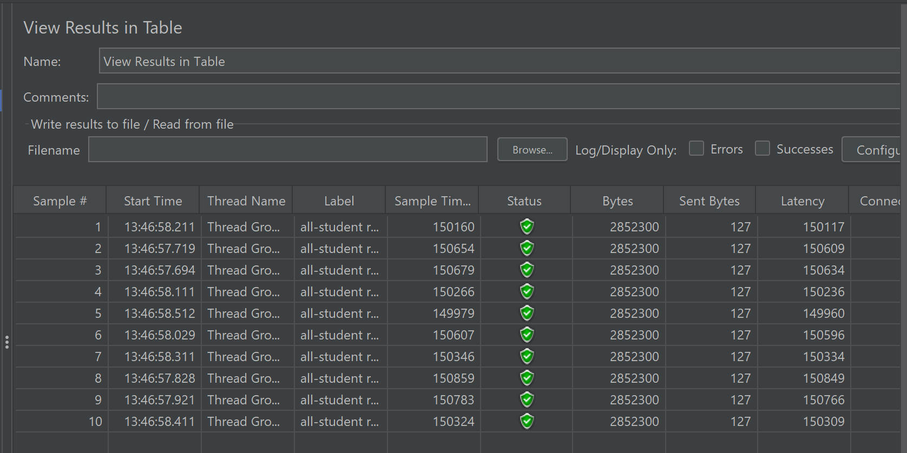
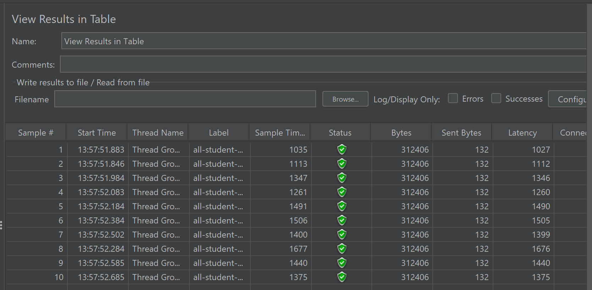
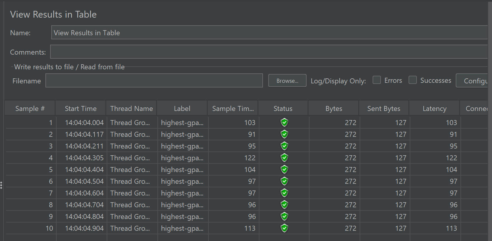
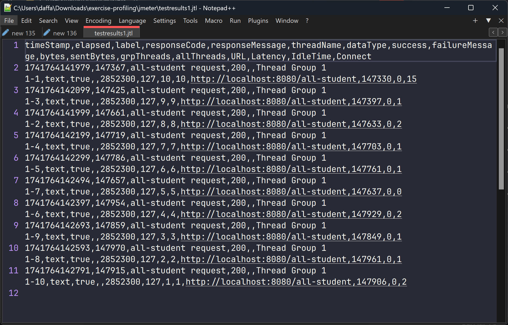
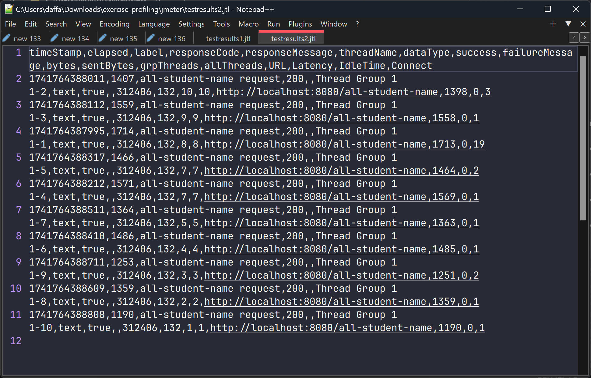
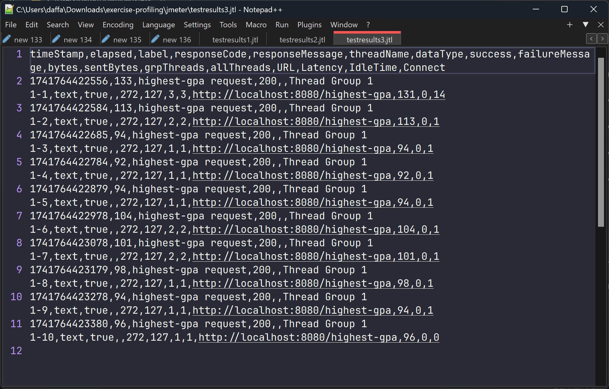

# Reflection

## Screenshots

### JMeter GUI Test Results

1. **`test_plan_1.jmx`**: `/all-student` endpoint
   

2. **`test_plan_2.jmx`**: `/all-student-name` endpoint
   

3. **`test_plan_3.jmx`**: `/highest-gpa` endpoint
   

### JMeter Logfile Test Results

1. **`test_plan_1.jmx`**: `/all-student` endpoint
   

2. **`test_plan_2.jmx`**: `/all-student-name` endpoint
   

3. **`test_plan_3.jmx`**: `/highest-gpa` endpoint
   

## 