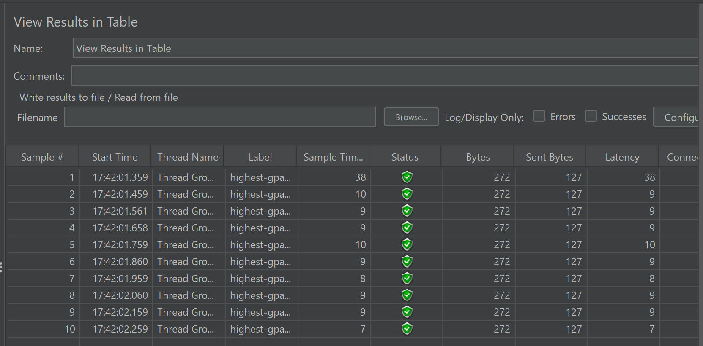
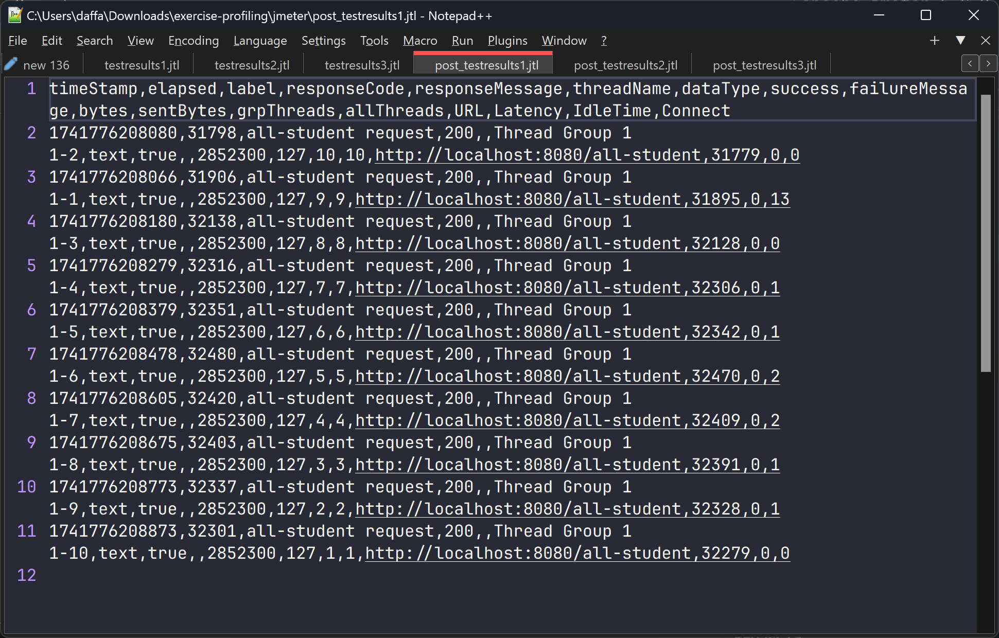

# Reflection

## Screenshots

### JMeter GUI Test Results

1. **`test_plan_1.jmx`**: `/all-student` endpoint
   

2. **`test_plan_2.jmx`**: `/all-student-name` endpoint
   

3. **`test_plan_3.jmx`**: `/highest-gpa` endpoint
   

### JMeter Logfile Test Results

1. **`test_plan_1.jmx`**: `/all-student` endpoint
   

2. **`test_plan_2.jmx`**: `/all-student-name` endpoint
   

3. **`test_plan_3.jmx`**: `/highest-gpa` endpoint
   

### \[Post-Profiling\] JMeter GUI Test Results

1. **`test_plan_1.jmx`**: `/all-student` endpoint
   

2. **`test_plan_2.jmx`**: `/all-student-name` endpoint
   

3. **`test_plan_3.jmx`**: `/highest-gpa` endpoint
   

### \[Post-Profiling\] JMeter Logfile Test Results

1. **`test_plan_1.jmx`**: `/all-student` endpoint
   

2. **`test_plan_2.jmx`**: `/all-student-name` endpoint  
   

3. **`test_plan_3.jmx`**: `/highest-gpa` endpoint
   

### Conclusion

After implementing profiling and performance optimizations, a significant improvement was observed across all test cases. The JMeter results show substantial reductions in execution time:

1. **All Students API**

   - Before Profiling: ~147,000-148,000 ms
   - After Profiling: ~31,000-32,500 ms
   - Improvement: ~78% reduction in execution time

2. **All Student Names API**

   - Before Profiling: ~1,200-1,700 ms
   - After Profiling: ~100-140 ms
   - Improvement: ~91% reduction in execution time

3. **Highest GPA API**
   - Before Profiling: ~90-130 ms
   - After Profiling: ~6-27 ms
   - Improvement: ~80-90% reduction in execution time

Implemented optimizations (query improvements, repository refinements, and efficient data handling) dramatically reduced response times across all endpoints, with the all-student-name endpoint showing the most significant improvement (>90% reduction). These results demonstrate how systematic performance profiling and targeted optimizations are essential for creating responsive, efficient applications by identifying bottlenecks and refining data access strategies.

### Questions and Answers

1. **What is the difference between the approach of performance testing with JMeter and profiling with IntelliJ Profiler in the context of optimizing application performance?**

Answer:  
JMeter tests external behavior and response times, while IntelliJ Profiler analyzes internal code execution to identify specific bottlenecks at method level.

2. **How does the profiling process help you in identifying and understanding the weak points in your application?**

Answer:  
Profiling helps by revealing CPU hotspots, inefficient memory allocation, excessive object creation, algorithm inefficiencies, and thread contention issues.

3. **Do you think IntelliJ Profiler is effective in assisting you to analyze and identify bottlenecks in your application code?**

Answer:
Yes, IntelliJ Profiler is effective because it integrates with the development environment, provides intuitive visualizations, connects performance data directly to source code, and offers multiple profiling modes.

4. **What are the main challenges you face when conducting performance testing and profiling, and how do you overcome these challenges?**

Answer:
Challenges include profiler overhead, data interpretation complexity, environment differences, and intermittent issues. I overcome these by using sampling mode, focusing on top bottlenecks, creating representative test data, and conducting extended profiling sessions.

5. **What are the main benefits you gain from using IntelliJ Profiler for profiling your application code?**

Answer:  
Key benefits include precise bottleneck identification, seamless IDE integration, actionable insights, multiple profiling types, visual representations, and immediate feedback during development.

6. **How do you handle situations where the results from profiling with IntelliJ Profiler are not entirely consistent with findings from performance testing using JMeter?**

Answer:
I would validate test conditions, consider concurrency effects, check for external factors, examine resource constraints, and use both tools complementarily to gain different perspectives on the performance issues.

7. **What strategies do you implement in optimizing application code after analyzing results from performance testing and profiling? How do you ensure the changes you make do not affect the application's functionality?**

Answer:
I optimize critical paths first, reduce object creation, improve data structures and algorithms, implement caching, and optimize database queries. I ensure functionality through comprehensive testing, incremental changes, code reviews, and monitoring behavior after deployment.
